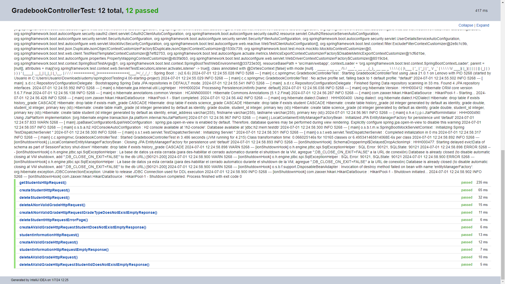
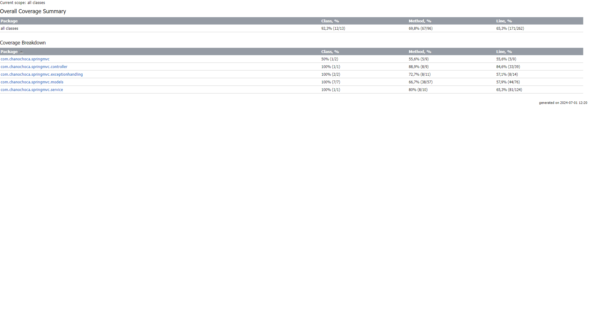
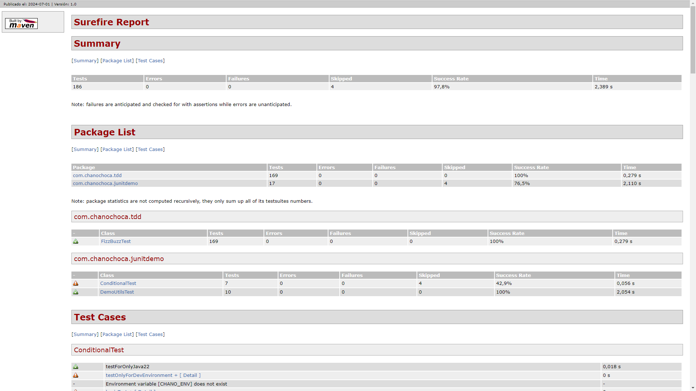
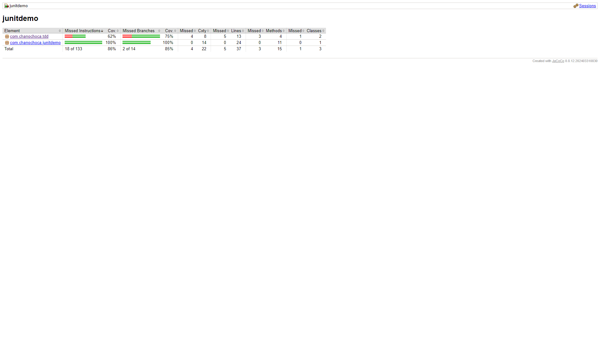

# Final POO

This is a project to testing with Mock and JUnit in Spring Boot

## Important
Remember view the [branches](https://github.com/ChanoChoca/SpringBootTesting/branches).

## Screenshots


## Tools Used

- Spring boot with maven
- MySQL


## Environment Variables

Remember run the .sql in MySQL to test the code.


## Run Application

```bash
  mvn spring-boot:run
```

## Where to see the test results?
**Run tests and export results.**

When running → three dots (click) → Export test results

This will generate an HTML where the result of the test (failed or passed) can be shown in detail.


**Run tests with code coverage.**

DemoUtilsTest → Run with coverage → Generate coverage report

This will generate an HTML file where you can see the test coverage in detail, including which classes, methods, and lines of code were covered successfully.


**Note**: The next step will only work if you have the `maven-surefire-plugin`, `maven-surefire-report-plugin` and `jacoco-maven-plugin` plugins, and the `junit-jupiter-api` and `junit-jupiter-params` dependencies.

See more information on https://maven.apache.org/surefire/maven-surefire-plugin/

By CMD: go to the folder and run `mvn clean test`

After seeing the results, use `mvn site -DgenerateReports=false`
This will generate several HTML files in the 'target' folder of the project, they are:
- target/site/surefire-report.html
  - This report provides extensive details on the test results.
    
- destination/site/jacoco/index.html 
  - Similar to the coverage report generated from the IDE, it provides extensive details on code coverage.
    

## Authors

- [@Juan Ignacio Caprioli (ChanoChoca)](https://github.com/ChanoChoca)


## Badges

[//]: # (Add badges from somewhere like: [shields.io]&#40;https://shields.io/&#41;)

[](https://choosealicense.com/licenses/mit/)
[](https://opensource.org/licenses/)
[](http://www.gnu.org/licenses/agpl-3.0)
