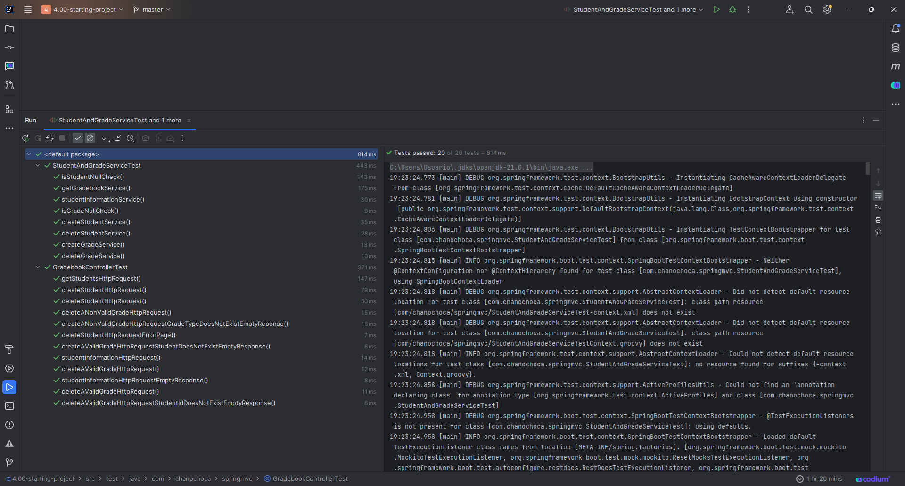
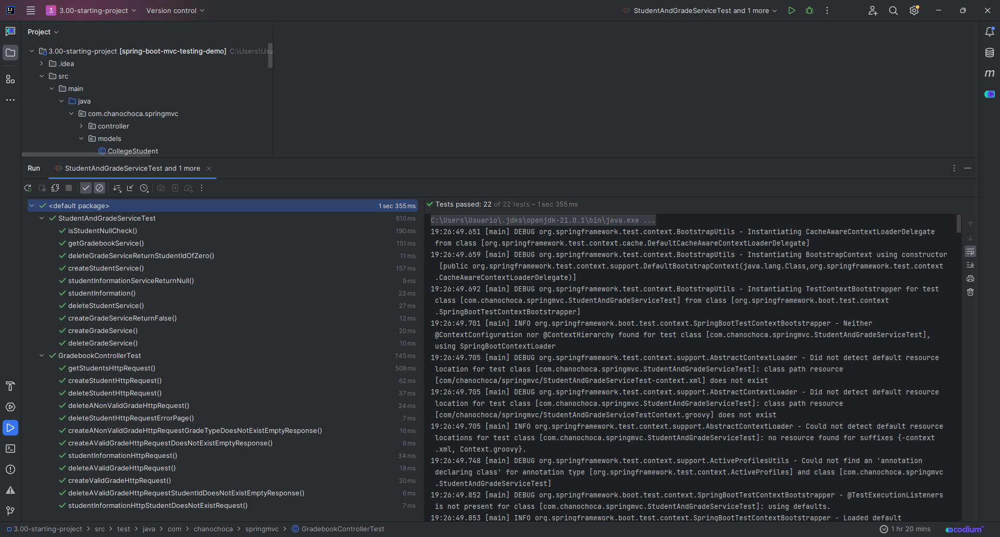
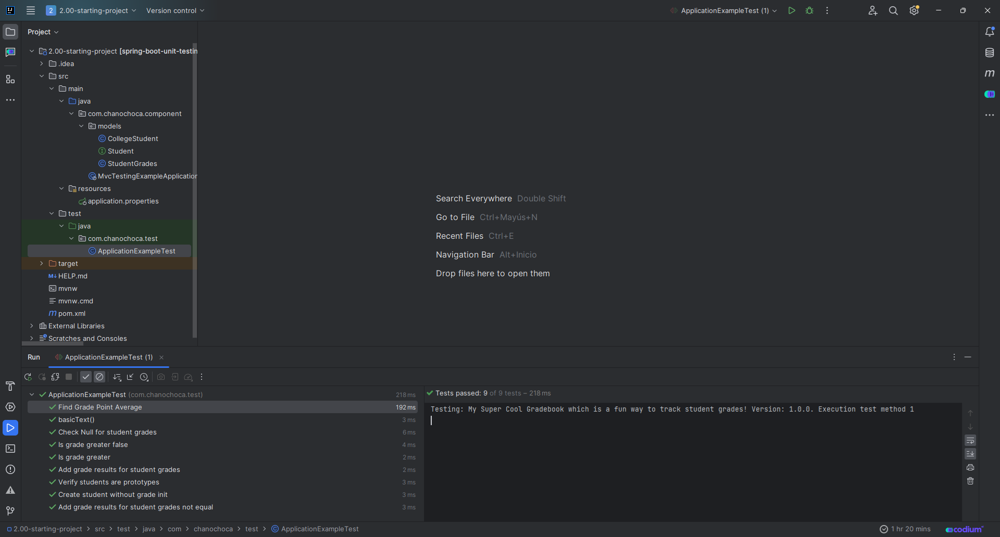
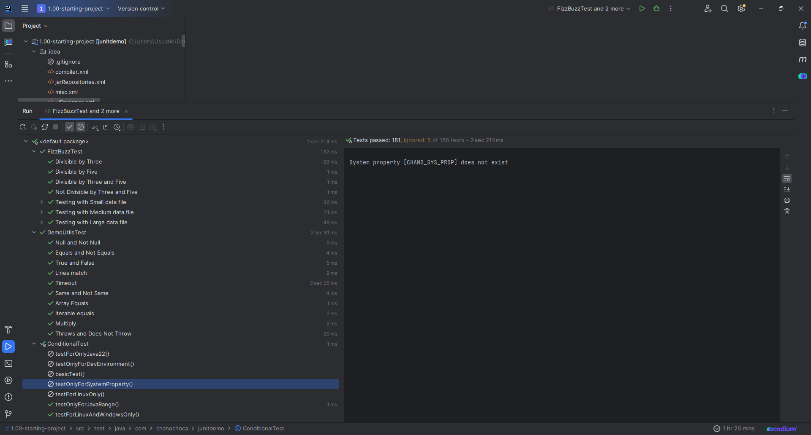

# Final POO

This is a project to testing with Mock and JUnit in Spring Boot

## Screenshots







## Tools Used

- Spring boot with maven
- MySQL


## Environment Variables

Remember run the .sql en MySQL to test the code.


## Run Application

```bash
  mvn spring-boot:run
```

## Authors

- [@Juan Ignacio Caprioli (ChanoChoca)](https://github.com/ChanoChoca)


## Badges

[//]: # (Add badges from somewhere like: [shields.io]&#40;https://shields.io/&#41;)

[](https://choosealicense.com/licenses/mit/)
[](https://opensource.org/licenses/)
[](http://www.gnu.org/licenses/agpl-3.0)
